# High-Level Support Solutions Retrieval API

This project provides a Retrieval-Augmented Generation (RAG) solution for efficiently querying support documents from [GoHighLevel's Help Center](https://help.gohighlevel.com/support/solutions). The solution includes data crawling, vector storage setup, and an advanced query-answering API built with FastAPI. The project is optimized to deliver relevant answers with citations, using techniques like vector similarity search, query augmentation, and content re-ranking.

## Project Overview

### 1. Web Crawling
The project starts with crawling the [GoHighLevel Help Center](https://help.gohighlevel.com/support/solutions) to extract support documents. This stage involves:

- **Script**: `crawler.py`
- **Process**:
  - Crawls all URLs starting from `https://help.gohighlevel.com/support/solutions`, using Selenium.
  - Saves all text content as Markdown files, excluding images and videos.
  - Stores output in the `content/crawl` directory with the following structure:
    - `processed_urls.json`: List of all processed URLs.
    - `scraped_content/`: Contains Markdown files for each URL.
    - `md_url_mapping.json`: Mapping between URLs and the corresponding Markdown files.

### 2. Vector Database Setup
The next stage is to process the Markdown files and store them in a vector database for efficient retrieval.

- **Database**: ChromaDB
- **Processing**:
  - Converts Markdown files into LangChain documents, with added metadata.
  - Metadata includes section summaries (generated using the GPT-4o-mini model) and document indexes (based on headers marked with `#`).
  - Splits documents at header levels (`#`) for finer granularity.
  - Stores the vector database in `content/crawl/high_level_support_solution_chroma_langchain_db`.

### 3. RAG Execution and API Setup
The final stage provides an API endpoint using FastAPI, which performs an advanced search with combined vector search, keyword search, and re-ranking.

- **Script**: `main.py`
- **Functionality**:
  - Takes a query string from the user and returns an answer with citations in JSON format: `{"answer": string, "citation": List of dict}`.
  - Uses GPT-4o-mini for domain-aware query augmentation, generating alternative queries based on document indexes.
  - Selects the top 10 documents from each of the four queries (original + 3 augmented).
  - Merges content from documents within the same URL, if applicable, and re-ranks them.
  - Passes the top 15 documents to GPT-4o-mini to generate the final response with answers and citations.

### Example API Response
The RAG system provides responses in the following format:

```json
{
  "answer": "To address A2P campaign rejection, follow these steps: ...",
  "citation": [
    {
      "title": "A2P 10DLC Campaign Approval Best Practices",
      "url": "https://help.gohighlevel.com/support/solutions/articles/48001229784"
    },
    {
      "title": "Fixing Failed Number Registrations (A2P Local and Toll-Free)",
      "url": "https://help.gohighlevel.com/support/solutions/articles/155000001454"
    }
  ]
}
```



## Getting Started

### Prerequisites
- Python 3.10.x
- `requirements.txt` contains all necessary libraries (install with `pip install -r requirements.txt`).
- API keys for OpenAI and Cohere (add these keys to your environment).

### Running the API

1. **Install Requirements**:
   ```bash
   pip install -r requirements.txt
   ```

2. **Set Environment Variables**:
   ```bash
   export OPENAI_API_KEY="your_openai_key"
   export COHERE_API_KEY="your_cohere_key"
   ```

3. **Start the FastAPI Server**:
   ```bash
   uvicorn main:app --reload
   ```

4. **Access the API Documentation**:
   Visit [http://127.0.0.1:8000/docs](http://127.0.0.1:8000/docs) for Swagger documentation.

### Making API Requests

You can use `curl` to test the endpoint:

```bash
curl -X 'POST' \
  'http://127.0.0.1:8000/get_answer' \
  -H 'accept: application/json' \
  -H 'Content-Type: application/json' \
  -d '{
  "input_text": "a sub account needs to transfer their existing phone number to their new high level account they created on their own"
}'
```

## Testing and Evaluation

To evaluate the RAG model's performance, a Jupyter Notebook `ragas_testing.ipynb` is provided, which includes scripts to assess the quality of the responses. Refer to the **`eval_dict.json`** to get response against the given questions


## Why This Approach?

### Challenges Observed with User Queries
User queries often contain a mixture of specific keywords (e.g., “LC,” “Twilio”) and longer, detailed phrasing. Initial attempts using a standard vector search led to desired documents appearing in the 50th to 70th positions, indicating a need for enhanced retrieval techniques.

1. **Hybrid Search (Vector + Keyword Search)**:
   - A hybrid approach was selected to leverage both semantic relevance (via vector search) and exact term matching (via keyword search).
   - However, even with re-ranking, the retrieval results only slightly improved, with relevant documents moving to the 40th-50th positions.

2. **Query Augmentation**:
   - Upon analysis, it was evident that many user queries were incomplete or ambiguous. I used GPT-4o to generate alternative queries based on document metadata (e.g., section headers) to supplement the initial query, hoping to cover more nuanced domain-specific terms.
   - Although query augmentation did help, it did not lead to significant improvements in document ranking alone.

3. **Incorporating Domain-Specific Knowledge**:
   - Through further testing, it became clear that domain-specific terminology was impacting retrieval effectiveness. To address this, I added document indexes (from headers marked by `#`) to metadata in the vector database.
   - The similarity search retrieves the top 150 documents, and the combined indexes provide domain-specific context to the GPT-4o model, aiding in the generation of alternative queries tailored to the domain.
   - This strategy reduced the appearance of desired documents to the top 15 positions in 93.5% of cases and the top 10 positions in 87% of cases, enhancing retrieval precision.

4. **Generating the Final Response**:
   - With the updated pipeline, the top 15 documents are passed to GPT-4o for response generation, yielding well-referenced answers that cite sources. 


## Future Improvements

1. **Enhanced Summarization**:
   - To handle more documents within the RAG pipeline, I plan to add enhanced summaries that distill essential information, improving document relevance and response generation.

2. **Domain-Specific Query Augmentation**:
   - Further analysis on query-specific patterns could enhance the query augmentation step, producing more precise alternative queries for each user query.

3. **Expanded Document Filtering**:
   - Instead of limiting to the top 15 documents, using summarization as an additional filtering mechanism can increase response accuracy, helping the LLM to generate higher-quality answers.

4. **Semantic Routing for Optimized Document Selection**:
   - Pre-processing documents to classify them based on themes (e.g., setup, troubleshooting, A2P campaigns) and classifying user queries dynamically can act as an additional filter in the RAG pipeline, narrowing down documents to contextually relevant ones.
